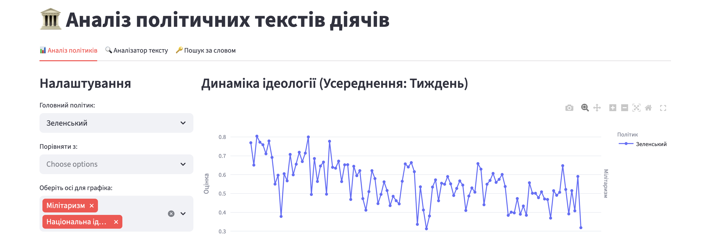
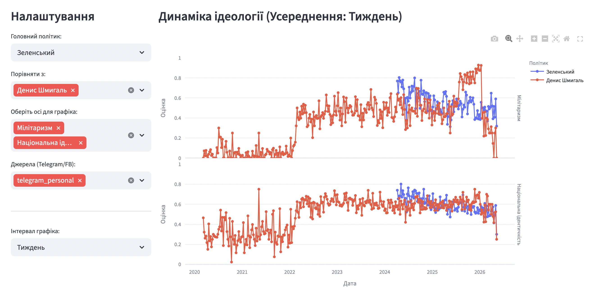
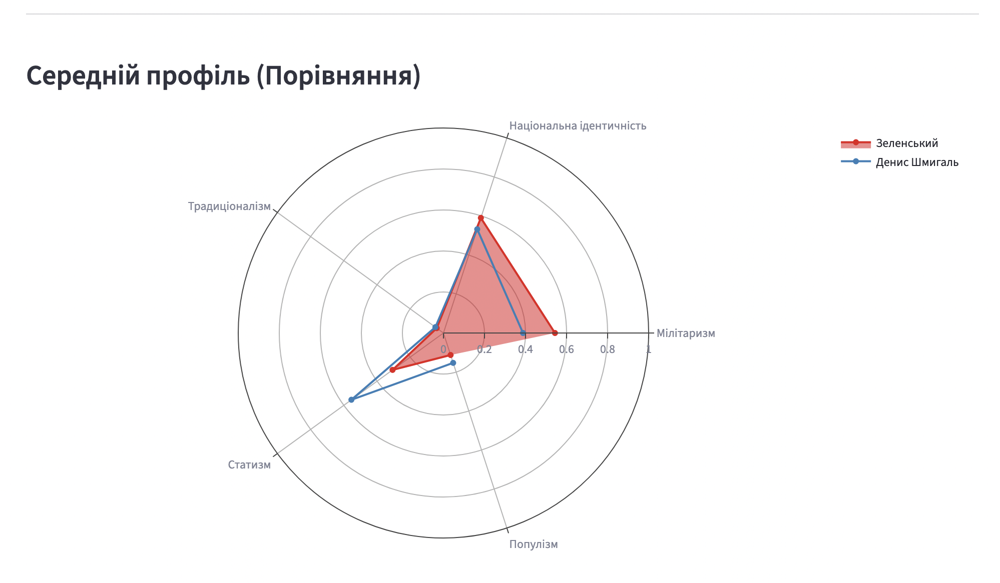
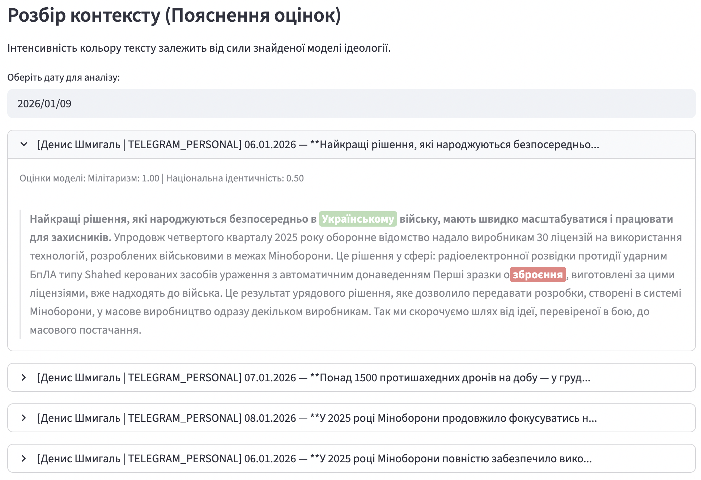
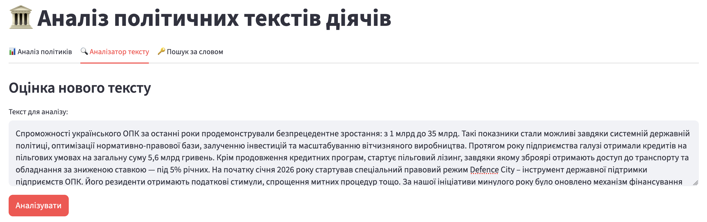
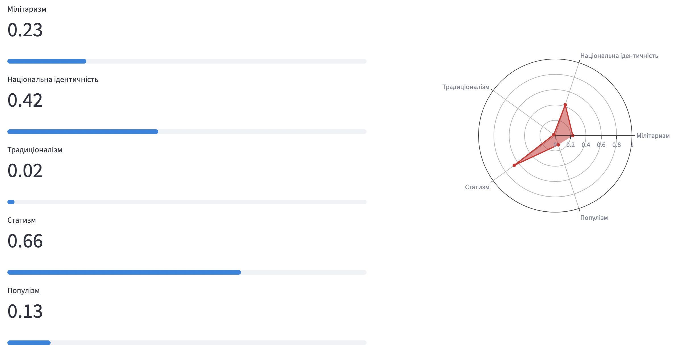
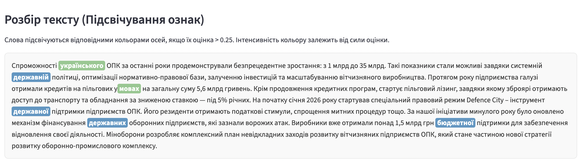
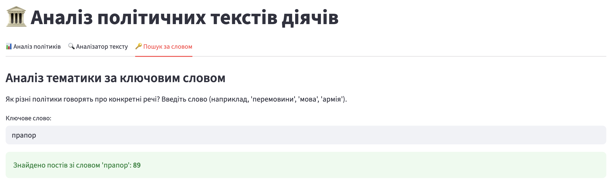
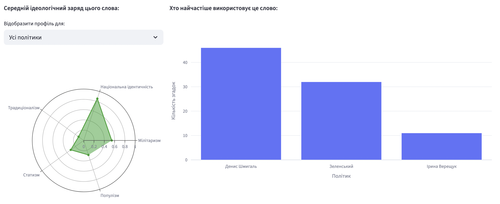
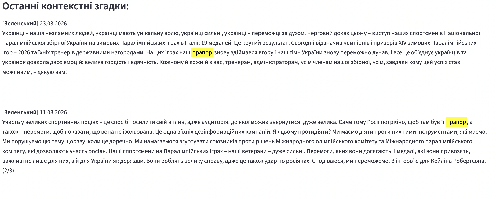

<h1 align="center">🏛️ Rhetoric Proximity</h1>

<p align="center">
  <b>Спектри політичної риторики: кількісний аналіз текстів у медіапросторі</b>
</p>

<p align="center">
  <a href="https://check-politician.streamlit.app/" target="_blank">
    🌐 Live Demo: https://check-politician.streamlit.app/
  </a>
</p>

---

<p align="center">
  
</p>

## 📌 Про проєкт

**Rhetoric Proximity** — це інноваційна платформа для кількісного аналізу політичної риторики в українському медіапросторі.

Проєкт усуває проблему суб’єктивності при порівнянні політичних текстів, переводячи оцінки у багатовимірні числові спектри.

Система аналізує тексти (Telegram-пости, Facebook, офіційні заяви) та автоматично визначає ідеологічні та риторичні маркери.

---

## 🚀 Можливості системи

### 1. 📊 Аналіз політиків (Dashboard)

Порівняння динаміки кількох політичних діячів одночасно на інтерактивних графіках.

<p>
  
  
  
</p>

---

### 2. 🧠 Explainability (Розбір контексту)

- Вивід першоджерел постів за обрану дату  
- Підсвічування токенів відповідно до впевненості моделі  
- Інтерпретація кожної ідеологічної осі

<p align="center">
  
</p>

---

### 3. ⚡ Runtime Inference (Аналіз тексту)

Миттєва оцінка будь-якого тексту з автоматичним виділенням ключових ознак.

<p>
  
  
  
</p>

---

### 4. 🔎 Vocabulary Analysis

- Аналіз семантичного та ідеологічного значення слова  
- Частота використання різними політиками  
- Побудова локального “радарного” профілю

<p>
  
  
  
</p>

---

## 📊 Аналізовані спектри (метрики)

Кожен текст оцінюється за шкалою **0.0 → 1.0**:

- **Мілітаризм / силове вирішення** — військова логіка, мобілізація, силові рішення  
- **Національна ідентичність** — суверенітет, мова, культурна самобутність  
- **Традиціоналізм** — моральні норми, сімейні цінності  
- **Статизм / порядок** — роль держави, контроль, централізація  
- **Популізм** — “народ vs еліти”, антикорупційна риторика  
- **Ліберально-плюралістична рамка** — права людини, свободи, децентралізація  

---

## 🧠 Архітектура моделі

### 🔧 Стек технологій

- **Frontend/UI:** Streamlit (сучасна версія з динамічним layout)
- **Ембедери:** SentenceTransformer  
  (`paraphrase-multilingual-mpnet-base-v2`)
- **Модель:** MultiOutputRegressor + Ridge Regression (L2)

---

### 🧬 Потенційна production-архітектура

Для fine-tuning передбачено використання **Ukrainian RoBERTa**:

$$
\text{Text} \rightarrow \text{Ukrainian RoBERTa} \rightarrow \text{Embedding (768)} \rightarrow \text{Dropout} \rightarrow \text{Linear (768→256)} + ReLU \rightarrow \text{Linear (256→5)} + Sigmoid \rightarrow [p_1, p_2, p_3, p_4, p_5]
$$

---

### 📦 Датасет

> ⚠️ MVP-версія моделі навчена на **синтетичних даних**, згенерованих через OpenAI API.  
> 10% датасету було вручну перевірено та скориговано відповідно до експертних гайдів розмітки.

---

## 💻 Локальний запуск

### 1. Клонування репозиторію

```bash
git clone https://github.com/your-username/rhetoric-proximity.git
cd rhetoric-proximity
```

---

### 2. Створення середовища

**macOS / Linux**

```bash
python3 -m venv venv
source venv/bin/activate
```

**Windows**

```bash
python -m venv venv
venv\Scripts\activate
```

---

### 3. Встановлення залежностей

```bash
pip install -r requirements.txt
```

Або вручну:

```bash
pip install streamlit pandas numpy sentence-transformers scikit-learn plotly joblib
```

---

### 4. Структура проєкту

```text
rhetoric-proximity/
├── app.py
├── political_model.joblib
├── requirements.txt
└── data/
    ├── annotated_posts_zelenskyy.json
    ├── annotated_denys_smyhal.json
    └── ...
```

---

### 5. Запуск застосунку

```bash
streamlit run app.py
```

Після запуску відкрийте:
`http://localhost:8501`

---

## 🌐 Демо

👉 **Live application:**
[https://check-politician.streamlit.app/](https://check-politician.streamlit.app/)

---

## 📄 Ліцензія

Проєкт створений для дослідницьких та освітніх цілей.
